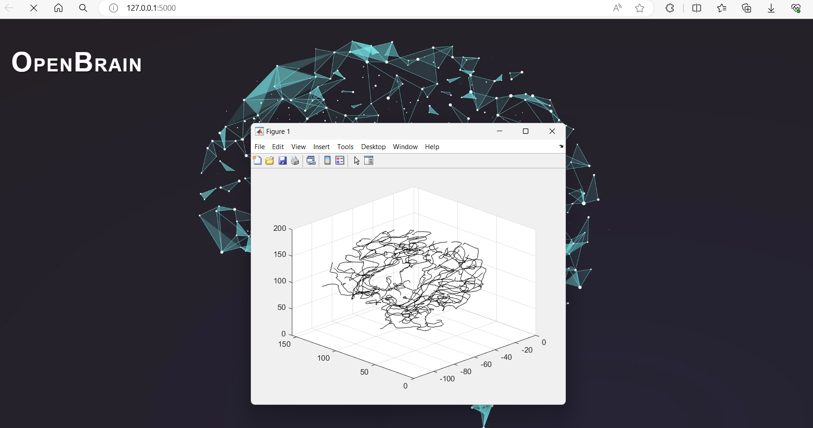
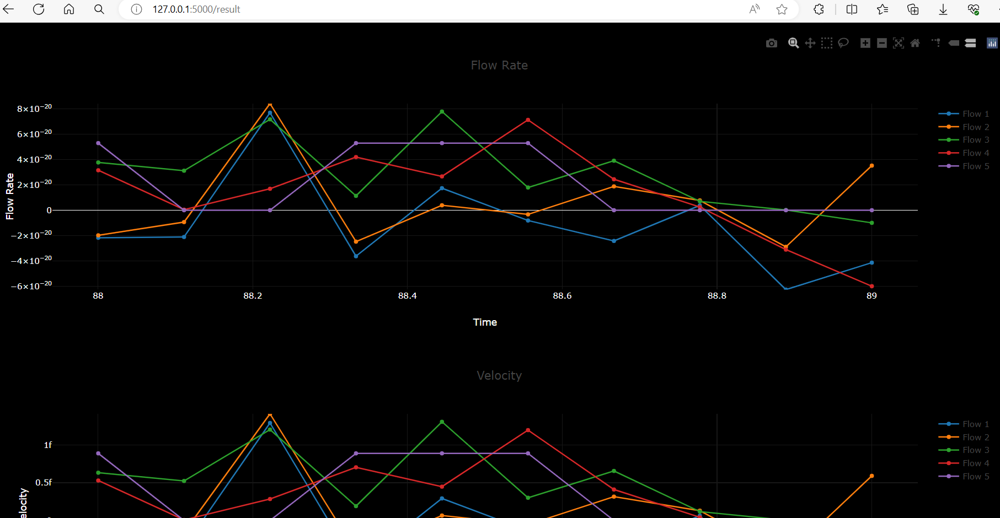

# OpenBrain
OpenBrain is a research project for Visualising Vascular Blood Flow and Pressure Measurements in the Brain through Non-Invasive methods

To run the application: python app.py

## Application interface

## Vessel network creation

## Hemodynamic visualisation in arterial network

